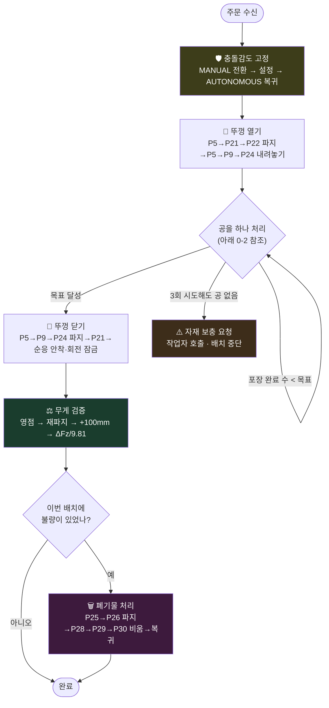
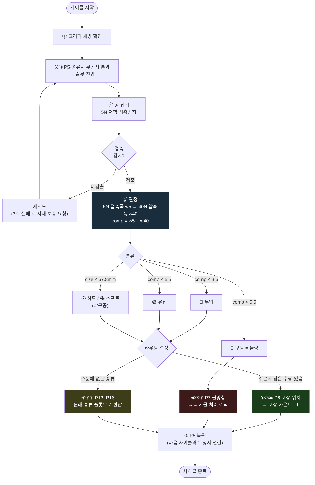
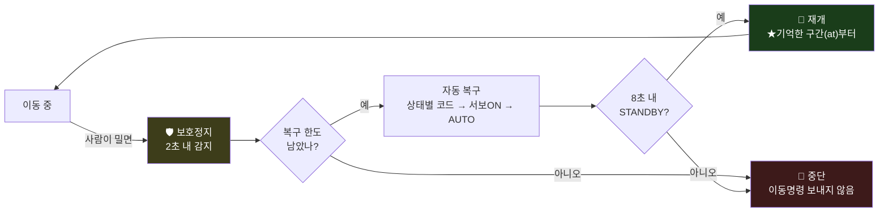
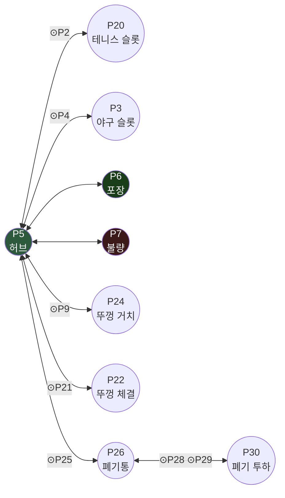
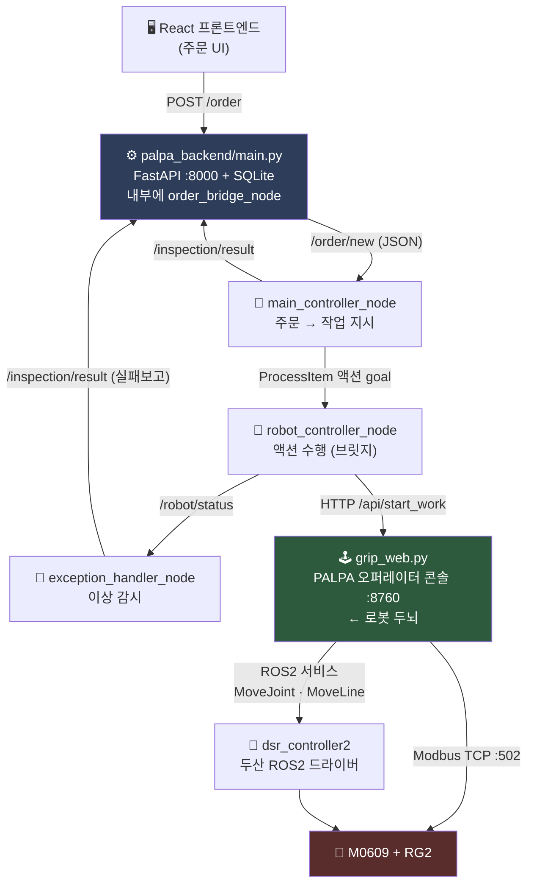

> **팀 프로젝트입니다.** 원본 저장소: https://github.com/yoon-taehwan/rokey_cobot_1_pjt
>
> 담당 파트: (내가 직접 채워 넣을 예정)

# PALPA — 촉각 기반 공 선별·포장 협동로봇

> **카메라 없이, 그리퍼의 파지력만으로 공의 상태를 판별하는 로봇 시스템**
> Doosan M0609 협동로봇 + OnRobot RG2 그리퍼

주문이 들어오면 로봇이 공을 하나씩 집어 **눌러보고**, 그 반응만으로 정상/불량을 가려
정상품은 포장하고 불량품은 폐기합니다. 비전 센서를 쓰지 않고 **힘 제어(force sensing)** 만으로
품질을 판정하는 것이 이 프로젝트의 핵심입니다.

| | |
|---|---|
| **판별 원리** | 5N으로 살짝 접촉 → 40N까지 압축. 이때 **얼마나 눌리는지(comp)** 로 내부 상태를 역산 |
| **판별 대상** | 테니스공(무압/유압/구멍) · 야구공(소프트/하드) |
| **부가 검증** | 포장 완료 후 통을 들어올려 **무게(Fz)** 로 수량 검증 |
| **조작 방식** | 브라우저 대시보드(로컬 웹) — tkinter가 ROS+Wayland에서 세그폴트를 내 웹으로 구현 |

---

## 목차

0. [작업 흐름 한눈에 보기](#0-작업-흐름-한눈에-보기)
1. [시스템 아키텍처](#1-시스템-아키텍처)
2. [노드 구조](#2-노드-구조)
3. [파일 구조](#3-파일-구조)
4. [설치](#4-설치)
5. [실행 방법](#5-실행-방법)
6. [웨이포인트 맵](#6-웨이포인트-맵)
7. [판정 알고리즘](#7-판정-알고리즘)
8. [데이터 파일](#8-데이터-파일)
9. [트러블슈팅](#9-트러블슈팅)

---

## 0. 작업 흐름 한눈에 보기

주문 하나가 들어와서 포장이 끝나기까지의 전체 흐름입니다.

### 0-1. 배치 흐름 — 묶음(포장 튜브) 1개 처리



> 묶음이 여러 개인 주문은 이 흐름 전체를 **묶음 수만큼 순차 반복**합니다.
> (묶음 1개 = 포장 튜브 1개 = 뚜껑 1사이클)

### 0-2. 공 1개 처리 사이클 — 판정과 라우팅



> 분류 경계값(`3.6` / `5.5` / `67.8mm`)은 **실측 데이터로 자동계산된 현재 값**입니다.
> `data/ball_thresholds.json`에 저장되며 코드 기본값을 덮어씁니다 — 재보정하면 바뀝니다.

### 0-3. 외력 자동복구 — 어느 단계에서든 끼어들 수 있음



> ⛔ **순응제어 구간(뚜껑 안착)만 예외** — 안전정지로 순응이 풀린 뒤 재이동하면
> 뚜껑을 강성으로 밀어 넣게 되므로 작업자 확인이 필요합니다.

### 0-4. 웨이포인트 이동 경로



`⊙` 표시는 **무정지 통과 경유점**입니다. 모든 흐름이 허브 **P5**를 지나며,
P5는 사방이 트여 있어 **45° 코너**로 가장 크게 돌아 부드럽게 통과합니다.
자세한 내용은 [docs/PATH_OPTIMIZATION.md](docs/PATH_OPTIMIZATION.md) 참조.

---

## 1. 시스템 아키텍처

전체는 **4개 계층**으로 나뉩니다. 주문은 위에서 내려오고, 로봇 상태는 아래에서 올라옵니다.



### 왜 `grip_web.py`가 로봇 두뇌인가

ROS 노드가 로봇을 직접 제어하지 않고 **`grip_web.py`에 HTTP로 위임**합니다.
실기에서 검증된 스택(드라이버 호출·그리퍼 Modbus·판정·안전복구·블렌딩)을 100% 재사용하기 위해서입니다.
덕분에 팀 통합 계약(`/palpa/process_item` 액션)을 지키면서도 **재테스트 위험이 0**입니다.

---

## 2. 노드 구조

### ROS2 노드 3종 (`palpa_ws/src/palpa_control/`)

#### 🧠 `main_controller_node` — 오케스트레이터
| | |
|---|---|
| **구독** | `/order/new` (`std_msgs/String`, JSON) ← 백엔드에서 신규 주문 |
| **발행** | `/inspection/result` (`InspectionResult`) → 백엔드가 DB 갱신 |
| **액션 클라이언트** | `/palpa/process_item` → `robot_controller_node` |

주문 JSON을 받아 **묶음(bundle) 단위로** 쪼개고, 판정 기준(무게/지름/탄성 threshold)을 실어
**한 묶음씩 순차로** 액션 goal을 보냅니다. 결과가 오면 그대로 `/inspection/result`로 보고합니다.
`order_contract.py`가 프론트엔드 품목명 → 로봇 SKU 변환을 담당합니다.

> **📦 작업 단위는 '묶음'입니다 (품목이 아닙니다)**
>
> ```
> 묶음 1개  =  포장 튜브 1개  =  뚜껑 열기 → 공 채우기 → 뚜껑 닫기  =  grip_web 배치 1개
> ```
>
> 한 주문이 여러 묶음으로 구성될 수 있고, **한 묶음에는 공이 최대 3개** 들어가며
> **종류가 섞일 수 있습니다**(무압 테니스 2 + 하드 야구 1 등).
>
> | 필드 | 의미 |
> |---|---|
> | `items[].bundle` | 이 품목이 몇 번째 묶음에 속하는지 (1-based) |
> | `bundleCount` | 이 주문의 묶음 총 개수 |
>
> 두 필드가 없는 구버전 payload는 **전부 묶음 1**로 처리되어 기존 동작과 같아집니다(하위호환).
> 용량 검사(1~3개)는 주문 전체가 아니라 **묶음별로** 걸립니다 — 백엔드
> `validate_order_contract()`와 `main_controller_node.on_new_order()` 양쪽에서 검증합니다.

#### 🦾 `robot_controller_node` — 실제 로봇 수행 (브릿지)
| | |
|---|---|
| **액션 서버** | `/palpa/process_item` (`ProcessItem.action`) |
| **발행** | `/robot/status` (`RobotStatus`) — IDLE / BUSY / ERROR / ESTOPPED |
| **위임 대상** | `http://127.0.0.1:8760` (grip_web) |

goal을 받으면 `/api/start_work`를 호출하고, `/api/status`를 폴링하며 진행 단계를 feedback으로
중계합니다. `ProcessItem.Goal`에 수량·묶음 필드가 없어 `item_id`에 인코딩해 전달합니다:

```
tennis_nopress#x3#b1#all=tennis_nopress:2,baseball_hard:1
└─ 대표 SKU ──┘ │   │   └─ 이 묶음(튜브)의 구성 = grip_web 의 targets
                │   └─ 묶음 번호 (완료 캐시 키 · 백엔드 배치 키)
                └─ 이 묶음의 목표 포장 수
```

> ⚠️ `#b{n}`이 없으면 완료 캐시가 주문 단위로 묶여 **2번째 튜브가 로봇 동작 없이 성공 처리**됩니다.

우리 사이클을 팀 계약 stage로 매핑합니다:

```
홈/경유/개방/진입/잡기 ─────────────────► PICKING
판정(5N 접촉 → 40N 압축) ──────────────► WEIGHING → MEASURING_DIAMETER
                                          → COMPRESSING → CLASSIFYING
포장 이송 + 놓기 ──────────────────────► PACKING     (success=True)
불량 이송 + 폐기 ──────────────────────► REJECTING   (success=False)
```

판정 주체는 **우리 `comp` 기준**(`config/classify.py`)이며, 실측 결과
`measured_weight / measured_diameter / measured_elasticity` 3값을 그대로 보고합니다.

> 🧪 **`robot_controller_stub_node`** — 로봇 없이 통합 테스트할 때 이 노드 대신 실행하는 시뮬레이션 대역.
> 동일한 액션·토픽을 제공하므로 상위 노드는 차이를 모릅니다.

#### 🚨 `exception_handler_node` — 안전 감시
| | |
|---|---|
| **구독** | `/robot/status` |
| **발행** | `/inspection/result` (실패 보고) |

로봇이 `ERROR` / `ESTOPPED`로 빠지면, 처리 중이던 아이템이 **DB에서 영원히 "처리중"으로
남지 않도록** 실패 결과를 대신 발행합니다.

### 메시지 / 액션 정의 (`palpa_ws/src/palpa_interfaces/`)

| 파일 | 내용 |
|---|---|
| `action/ProcessItem.action` | 아이템 1개 처리 요청/피드백/결과 |
| `msg/InspectionResult.msg` | `order_id, item_id, success, final_stage, measured_weight, measured_diameter, measured_elasticity, reject_reason, stamp` |
| `msg/RobotStatus.msg` | `node_name, state, current_order_id, current_item_id, message` |

---

## 3. 파일 구조

### 로봇 두뇌 — 오퍼레이터 콘솔

```
grip_web.py            진입점. 워커 스레드 4개 생성 + HTTP 서버 기동
palpa_ui.html          실제 대시보드 UI (요청마다 새로 읽어 서빙 → 새로고침만으로 반영)
paths.py               데이터 파일 위치 단일 소유 (data/ 기준, PALPA_DATA_DIR로 변경 가능)
calibrate.py           측정 CSV → 판별 임계값 자동 계산 (오프라인 도구)
```

#### `core/` — 하드웨어 · 스레드 · HTTP 계층

| 파일 | 역할 |
|---|---|
| `runtime.py` | 프로세스 전역 공유 상태(`STATE/ROBOT/JOG/JOINTS`, 락, 웨이포인트) |
| `rg2.py` | RG2 하드웨어 계층 — 상수, 너비↔각도 환산, **순수 소켓 Modbus TCP**(외부 라이브러리 없음) |
| `gripper.py` | `GripperState` — 그리퍼 소켓 I/O **단독 소유**, 측정·판별·CSV 기록 |
| `monitor.py` | `JointSub`(관절각 토픽) · `RobotMonitor`(상태/힘/무게 서비스 폴링) |
| `jog.py` | `JogWorker` — **모든 로봇 모션이 지나가는 단일 스레드**(조그·주문사이클·블록실행·폐기물) |
| `api.py` | HTTP `Handler` — 39개 `/api` 엔드포인트 + 페이지 서빙 |
| `store.py` | 웨이포인트 / 블록 프로그램 파일 입출력 |
| `legacy_page.py` | 내장 폴백 UI — `palpa_ui.html`이 없을 때만 서빙 |

> ⚠️ **`runtime.py` 사용 규칙**: `from core.runtime import STATE` 는 그 시점의 `None`을 복사해
> 버립니다. 반드시 `from core import runtime as RT` 후 **`RT.STATE`** 로 접근하세요.

#### `config/` — 설정 (퍼사드: `grip_config.py`)

| 파일 | 역할 |
|---|---|
| `motion.py` | 속도 프로파일 · **이동별 속도(19개)** · 블렌딩 · 충돌감도 · 모션 완료판정 |
| `classify.py` | 공 판별 임계값 · 특징 정의 · `classify()` |
| `waypoints.py` | 주문 SKU 코드 · 라우팅 결정 · 웨이포인트 이름표/역할 |
| `gripper.py` | RG2 동작 파라미터(파지력·대기·측정·폐기물) |

코드 전체가 `import grip_config as cfg` 하나만 쓰면 됩니다.

#### `sequences/` — 로봇 동작 시나리오 (퍼사드: `grip_cycle.py`)

| 파일 | 역할 |
|---|---|
| `order.py` | 주문 파지 사이클 — 진입·파지·판정·라우팅·이송·복귀 |
| `lid.py` | 뚜껑 열기 / 닫기 + 순응제어 안착 + 통 무게 검증 |
| `waste.py` | 폐기물 처리 — 폐기통 파지·비움·원위치 |
| `common.py` | 중단/트립 예외, 웨이포인트 탐색 헬퍼 |

### 상위 계층

```
palpa_ws/src/palpa_control/      ROS2 노드 3종 + stub + order_contract
palpa_ws/src/palpa_interfaces/   액션 1개 + 메시지 2개
palpa_backend/main.py            FastAPI :8000 + SQLite + order_bridge_node
tests/                           라우팅·백엔드 계약·묶음 주문 단위 테스트
data/                            런타임 데이터 (아래 8장 참조)
```

---

## 4. 설치

### 사전 요구사항

| 항목 | 버전 |
|---|---|
| Ubuntu | 22.04 |
| ROS2 | Humble |
| Python | 3.10+ |

### ⚠️ 외부 의존 — 두산 드라이버는 이 저장소에 없습니다

이 저장소는 **애플리케이션 계층**만 담고 있습니다. 로봇 팔을 움직이려면 별도 워크스페이스에
아래 패키지가 필요합니다:

| 패키지 | 출처 |
|---|---|
| `doosan-robot2` | [github.com/DoosanRobotics/doosan-robot2](https://github.com/DoosanRobotics/doosan-robot2) |
| `m0609_rg2_bringup` | M0609 + RG2 통합 launch (사내/현장 구성) |

### 설치 절차

```bash
# 1) 이 저장소
git clone <저장소-URL> palpa_project_final
cd palpa_project_final

# 2) ROS 인터페이스/노드 빌드
cd palpa_ws
colcon build --symlink-install
source install/setup.bash
cd ..

# 3) 백엔드 의존성 (백엔드를 쓸 때만)
pip install fastapi "uvicorn[standard]" --break-system-packages
```

> `grip_web.py`는 **표준 라이브러리만** 사용합니다. Modbus도 직접 구현되어 있어
> `pymodbus` 같은 추가 설치가 필요 없습니다.

---

## 5. 실행 방법

### 최소 구성 — 로봇 + 대시보드만 (개발·튜닝용)

```bash
# ── 터미널 1 : 팔 드라이버 ──────────────────────────────
source /opt/ros/humble/setup.bash
source ~/ws_cobot_pjt/ws_dsr/install/setup.bash
export ROS_DOMAIN_ID=60
ros2 launch m0609_rg2_bringup bringup.launch.py mode:=real

# ── 터미널 2 : 오퍼레이터 콘솔 ──────────────────────────
source /opt/ros/humble/setup.bash
source ~/ws_cobot_pjt/ws_dsr/install/setup.bash
export ROS_DOMAIN_ID=60          # ★ 드라이버와 반드시 같아야 로봇 데이터가 보임
cd palpa_project_final
python3 -u grip_web.py
```

브라우저에서 **http://localhost:8760** 접속.

> 인자를 바꾸려면: `python3 grip_web.py <그리퍼IP> <UnitID> <포트>`
> (기본값 `192.168.1.1 65 8760`)

### 전체 구성 — 주문 파이프라인까지

위 2개 터미널에 더해:

```bash
# ── 터미널 3 : 백엔드 (주문 수신 + DB) ──────────────────
cd palpa_project_final/palpa_backend
uvicorn main:app --host 0.0.0.0 --port 8000

# ── 터미널 4 : ROS 노드 3종 ─────────────────────────────
source palpa_ws/install/setup.bash
export ROS_DOMAIN_ID=60
ros2 run palpa_control robot_controller_node &
ros2 run palpa_control main_controller_node &
ros2 run palpa_control exception_handler_node &
```

### 🧪 로봇 없이 테스트

```bash
ros2 run palpa_control robot_controller_stub_node   # robot_controller_node 대신
```

### ✅ 실행 순서가 중요합니다

```
드라이버 → grip_web → ROS 노드 → 백엔드
```
`robot_controller_node`는 기동 시 `:8760`을 확인하므로 **grip_web이 먼저** 떠 있어야 합니다.

---

## 6. 웨이포인트 맵

전부 `data/waypoints.json`에 관절각으로 저장되며, 대시보드의 **웨이포인트 탭**에서 티칭·수정합니다.

| # | 이름 | 용도 |
|---|---|---|
| P1 | 테니스공 슬롯 잡는 위치 | 테니스공 파지 |
| P2 | 테니스공 잡고난 경유지 | 무정지 통과(블렌딩) |
| P3 | 야구공 슬롯 잡는 위치 | 야구공 파지 |
| P4 | 야구공 잡고 난 경유지 | 무정지 통과(블렌딩) |
| **P5** | **전체 경유지** | **모든 흐름의 허브 — 코너 45°로 크게 돌아 무정지 통과** |
| P6 | 포장 품목 넣는 위치 | 정상품 투입 |
| P7 | 불량 품목 넣는 위치 | 불량품 투입 |
| P8~P12 | 뚜껑 잡기 / 장착 / 회전 | 순응제어(compliance) 구간 |
| P13~P16 | 슬롯 보충 | 야구공/테니스공 재보충 |
| P17~P19 | 포장 검증 | 통을 들어 무게 측정 |
| P20~P24 | 갱신 포인트 | T8·T10·T11·T12 업데이트본 |
| P25~P30 | 폐기물 처리 | 폐기통 파지 → 비움 → 원위치 |

### 모션 블렌딩 — 실측으로 얻은 교훈

> **`radius` 파라미터는 이 드라이버의 비동기 경로에서 동작하지 않습니다.**
> `amovej`가 `radius`를 전달하지 않기 때문입니다. 실제 코너 크기는
> **`lead_deg`** — *다음 명령을 언제 보내는가(남은 각도)* — 로 제어합니다.

| 구간 | lead 각도 |
|---|---|
| P5(허브) 진입/진출 | 45° |
| 일반 구간 | 15~25° |
| 슬롯 접근 | 18° |
| 폐기 경로 | 10~20° |
| P29 → P28 (역순 복귀) | 동기 이동 (충돌 위험 구간) |

> ⚠️ `MoveSplineJoint` 실행 중에 `amovej`를 겹쳐 보내면 **알람 없이 컨트롤러가 멈춥니다**(흰불).

### 📚 심화 문서

| 문서 | 내용 |
|---|---|
| **[docs/CLASSIFICATION.md](docs/CLASSIFICATION.md)** | 공 판별 알고리즘 — 파지력·폭만으로 종류·상태 구분, 특징 설계, 캐스케이드 게이트, **실측 56개 전수 100%** |
| **[docs/PATH_OPTIMIZATION.md](docs/PATH_OPTIMIZATION.md)** | 경로 최적화 — radius가 왜 안 되는지(드라이버 소스 추적), lead_deg 방식의 원리·구현, 사고 6건과 해결 |
| **[docs/WEIGHT_SENSING.md](docs/WEIGHT_SENSING.md)** | 무게 감지 — 차분 측정 원리, 계산식 전부, 노이즈 억제 2단, 설계 결정 4건 |
| **[docs/AUTO_RECOVERY.md](docs/AUTO_RECOVERY.md)** | 외력 자동복구 — 감지·복구·재개 3단계, **진행 위치 기억(at 인덱스)**, 위치 추정의 함정 |
| **[docs/COMPLIANCE_CONTROL.md](docs/COMPLIANCE_CONTROL.md)** | 순응제어 — 축별 강성 설계(왜 Z만 무르게, RZ만 단단하게), 뚜껑 안착·체결, MoveJ 금지 제약 |

---

## 7. 판정 알고리즘

### 측정 시퀀스

```
1. 5N 으로 접근 ──── 접촉 감지    →  w5  (공의 크기)
2. 40N 까지 압축 ─── 0.8초 유지   →  w40 (눌린 후 크기)
3. comp = w5 − w40                    ← 이 값이 판정의 핵심
```

### 접촉 감지 — RG2 공식 절차

```
명령 전송 → busy(bit0) 상승 대기 → busy 하강 대기 → 그때 grip bit(bit1) 판독
```

> ⚠️ `busy=1`인 동안 grip bit를 읽으면 **허공에서도 접촉으로 오인**해 40N으로 슬램합니다.
> 반드시 busy가 내려간 뒤에 판독해야 합니다.

### 분류 기준 — 현재 적용값

| 단계 | 판정 |
|---|---|
| `size > 67.8mm` | 테니스공 / 이하 야구공 |
| 테니스공 | `comp ≤ 3.6` 무압 · `≤ 5.5` 유압(정상) · 초과 구멍(불량) |
| 야구공 | `comp ≤ 2.55` 하드 · 초과 소프트 |

> ⚠️ **위 값은 `config/classify.py`의 코드 기본값이 아니라 `data/ball_thresholds.json`의 값입니다.**
> 기동 시 `load_thresholds()`가 JSON을 읽어 **코드 기본값을 덮어씁니다.**
> 코드만 고치고 JSON을 안 지우면 반영되지 않으니 주의하세요.

임계값은 `calibrate.py` 또는 대시보드의 **자동계산** 버튼으로 실측 CSV에서 다시 뽑습니다.
결과는 `data/ball_thresholds.json`에 저장되어 재시작해도 유지됩니다.

> 📌 **캐스케이드 게이트 주의**: 첫 게이트는 반드시 **하위 전체**와 비교해야 합니다.
> `무압 vs 유압`만 보면 구멍이 무압으로 새 들어갑니다. → `무압 vs [유압, 구멍]`

### 무게 측정 — 노이즈 억제

동일 자세에서 **차분(ΔFz)** 을 취해 중력보상 오차를 상쇄합니다.

```
① 그리퍼를 활짝 열고 영점(Fz₀) 측정   ← 공기 중 순수 기준
② 다시 파지 → Z축으로만 상승
③ 절사평균(trim 20%) + 적응형 안정화(std < 0.35 연속 8회)
④ 무게 = |ΔFz| / 9.81
```

---

## 8. 데이터 파일

전부 `data/` 안에 있으며 **실행 중 덮어쓰기**됩니다 (마지막 저장 상태이지 공장 초기값이 아닙니다).

| 파일 | 내용 | 생성 |
|---|---|---|
| `waypoints.json` | 티칭한 P1~P30 관절각 | 웨이포인트 탭 |
| `sequences.json` | 블록 프로그램 | 시퀀스 탭 |
| `speed_profile.json` | 이동별 속도 19개 + 전역 배속 | 속도 탭 |
| `ball_thresholds.json` | 판별 임계값 | 자동계산 |
| `ball_measurements_final.csv` | 측정 이력(학습 데이터) | 측정할 때마다 누적 |

### 다른 위치를 쓰려면

```bash
PALPA_DATA_DIR=~/robot_A_data python3 grip_web.py
```

---

## 9. 트러블슈팅

### 🔴 드라이버가 안 붙음 — `INITIAL STATE CALL FAILURE !!`

```
[dsr_hw_interface2]: INITIAL CONTROL_SERVO_ON called   ← 10회 반복
[dsr_hw_interface2]: INITIAL STATE CALL FAILURE !!
```

로그에 `MANAGE_ACCESS_CONTROL_FORCE_REQUEST`가 **없다면** 제어권은 확보된 것이고,
로봇이 **STANDBY 상태로 들어가지 못하는** 것입니다.

| 원인 | 해결 |
|---|---|
| **드라이버 중복 실행** (가장 흔함) | 두산 컨트롤러는 **클라이언트 1개만** 받습니다. 아래 정리 후 재실행 |
| 안전 알람 / 비상정지 | 펜던트에서 알람 리셋 → 서보 ON → **AUTO 모드** 확인 |
| 이전 세션의 유령 노드 | `kill -9` 로 강제 종료 (SIGTERM을 무시하는 경우가 있음) |

```bash
pkill -f m0609_rg2_bringup; pkill -f palpa_control; pkill -f rviz2
pkill -f robot_state_publisher; pkill -f controller_manager
sleep 3
pgrep -af "ros2_control_node|bringup|palpa_control"   # 아무것도 안 나와야 함
```

로그 위쪽의 `ROBOT_STATE : STATE_XXX` 줄이 정확한 상태를 알려줍니다.

### 🟡 안전 알람 코드

| 코드 | 의미 | 조치 |
|---|---|---|
| `5.7060` | 서보온 자가검사 실패 (payload/공구 불일치) | 펜던트에서 공구를 현재공구로 지정. **코드에서 `set_tool` 호출 금지** |
| `5.7170` | 자동모드에서 충돌감도 변경 시도 | 충돌감도는 **MANUAL에서만** 변경 가능 |
| `5.7173` | 충돌 감지 | 감도 확인 후 복구 |

> ⚠️ DRFL `set_tool`은 펜던트에서 만든 공구를 활성화하지 못하고, 실패 시 현재공구를
> 비워버려 payload를 잃습니다 → `5.7060` 유발. **절대 호출하지 마세요.**

### 🟠 대시보드가 옛날 UI로 보임

`palpa_ui.html`을 못 찾아 내장 폴백 UI로 넘어간 것입니다.
콘솔에 `[ui] palpa_ui.html 서빙 실패 → ...` 이유가 찍힙니다.
프로젝트 루트에서 실행했는지 확인하세요.

### 🟠 그리퍼가 가끔 힘을 안 줌

같은 명령이 연속으로 들어가면 중복 제거에 걸립니다.
`core/gripper.py`의 dedup 키는 **`(너비, 힘)` 쌍**이어야 합니다 (너비만 쓰면 힘 변경이 무시됨).

### 🟠 포트 8760 충돌

```bash
ps -C python3 -o pid,cmd | grep grip_web    # 정확히 찾아서
kill <pid>
```

> ROS 환경을 source 하지 않은 셸에서 `grip_web.py`를 띄우면 포트만 차지하고
> 드라이버는 못 봅니다. **반드시 `ROS_DOMAIN_ID`를 맞춘 터미널에서 실행하세요.**

### ⚙️ 속도가 설정값보다 느림

가속도 한계 때문에 삼각 프로파일이 되면 최고 속도에 도달하지 못합니다.
`config/motion.py`의 `*_acc_max`와 `acc_ratio`를 함께 올려야 합니다.

---

## 라이선스 / 크레딧

Doosan M0609 · OnRobot RG2 기반 협동로봇 팀 프로젝트.
로봇 제어 계층(`grip_web` + `core/config/sequences` + `palpa_control`) 구현.
